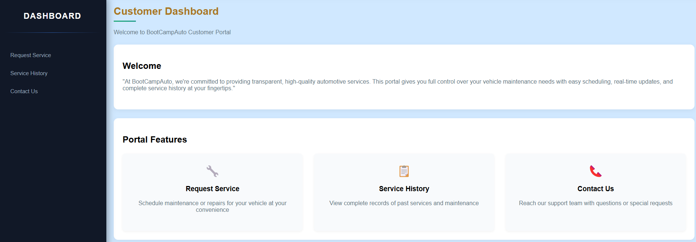
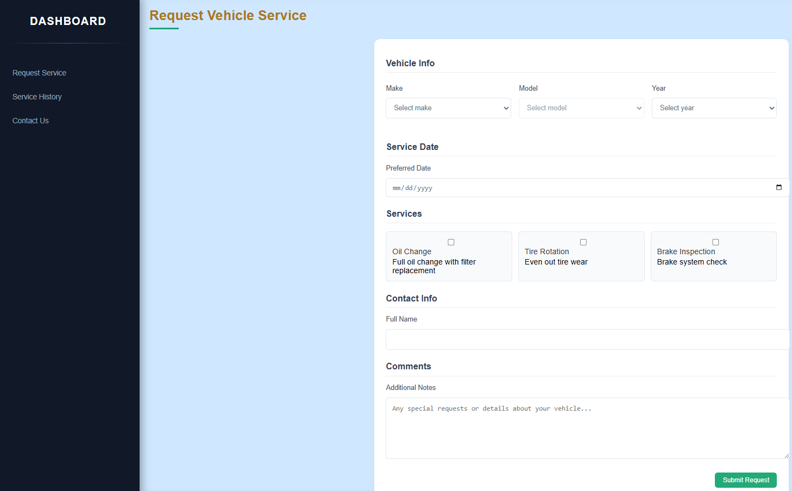
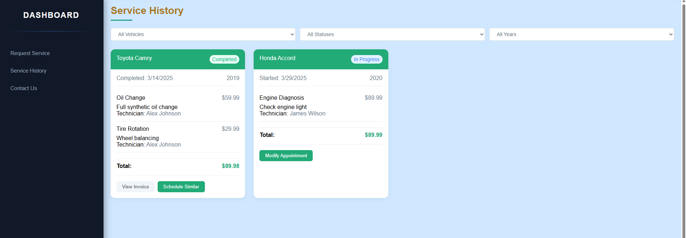
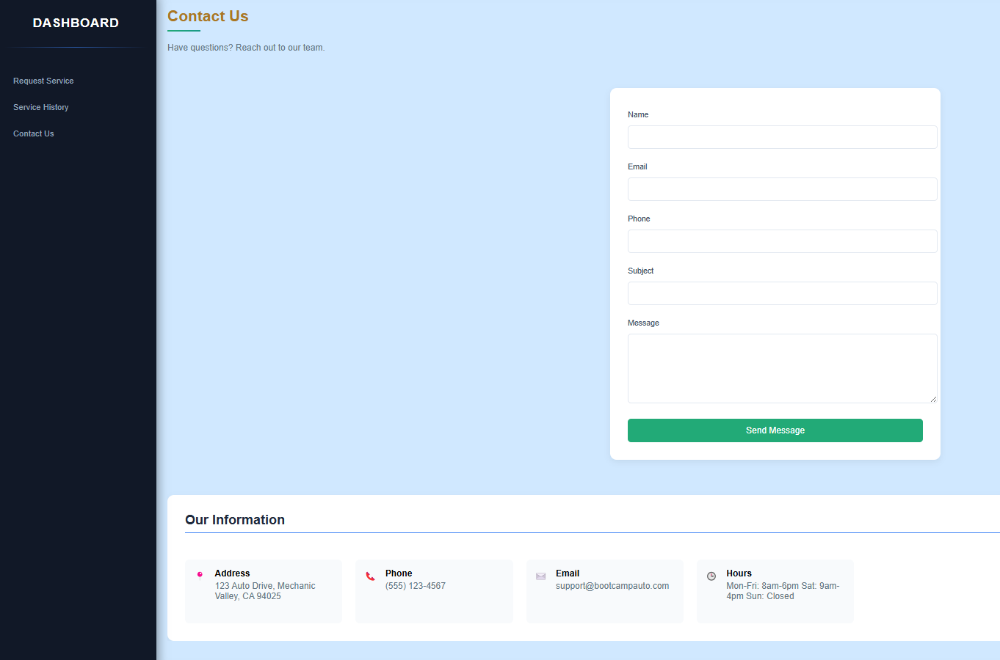

# Project 2 : Fleet Repair Shop
  
  ## Description
    Interactive vehicle maintenance scheduler with functional customer and employee pages. Through this application, customers can schedule maintenance, request services and view their previous service history all within the application. Employees are able to view vehicles that are scheduled for maintenance or currently being serviced, and also order the necessary parts for their tasks. 

  ## User Story
  ``` md
    AS A fleet maintenance shop owner
    I WANT a fleet maintenance scheduler with a secure login page
    SO THAT I can efficiently track maintenance tasks, schedule repairs, and manage vehicle 
    availability.
    WHEN a vehicle is due for maintenance,  a user is notified upon logging into their 
    profile. 
```


  ## Table of Contents
  - [Installation](#installation)
  - [Usage](#usage)
  - [License](#license)
  - [Contributors](#contributors)
  - [Tests](#tests)
  - [Questions](#questions)
  ## Installation
  - npm i to install dependency packages
  - npm start to run application 
  ## Technologies used 
    * React
    * PostgresSQL
    * Github
    * VS Code
    * Git Bash
    * Bootstrap
    * Slack
    * Pure CSS
    * W3 Schools
    * Stack Overflow 

  ## Screenshot 
  
  
  
  

  ## Dependencies 

  ## Tests 
  npm run start:dev
  ## License 
  
  ## Questions